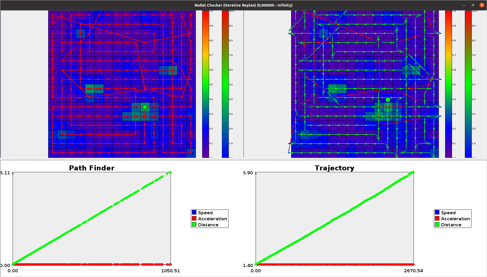

# Acceleration-Aware Path Planning

## Installation
The code was written int Eclipse IDE with the integrated automated build system.
Simply import the code into your workspace and start using it.

## Usage
### Configuration

The configuration window offers a lot of parameters to specifiy. First of all, the path finding algorithms one would like to compare should be selected.
Next, the user can choose from various different probability distributions to use for the simulations.
Besides that, parameters like starting position can be choosed as well as parameters concerning the drone (speed and acceleration).

### Overview

After all simulations have been computed, an overview is shown. For each algorithm, the found path defining the cell visiting order (discrete cells) is shown.
Double clicking reveals another window as explained later. On the bottom the APT graph is shown for all compared algorithms.

### Trajectory Viewer

This windows allows a direct comparison between the found path and the planned trajectory.
The trajectory includes acceleration and deceleration segments and is used for calculating the total duration.

## Important files

The code of our main algorithms can be found here:
* Grid: src/at/jku/cg/sar/pathfinder/misc/GridFinder.java
* Spiral: src/at/jku/cg/sar/pathfinder/misc/SpiralFinder.java
* Potential Field: src/at/jku/cg/sar/pathfinder/apf/AttractionApproachGradient.java
* Radial Gradient Accent: src/at/jku/cg/sar/pathfinder/misc/RadialChecker.java
* Continuous Gradient: src/at/jku/cg/sar/pathfinder/vacuum/VacuumCleanerGradient.java

Code concerning our trajectory planner can be found here:
* src/at/jku/cg/sar/trajectory/TrajectoryPlanner.java
* src/at/jku/cg/sar/trajectory/SimpleTrajectory.java